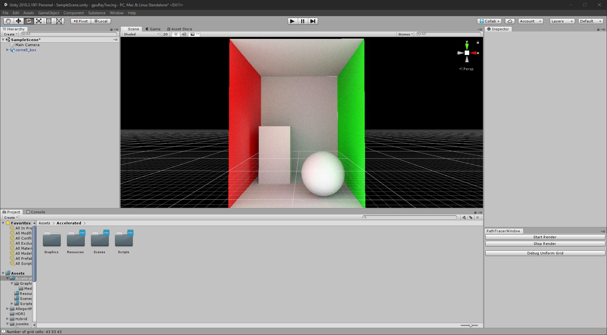

# Unity Editor GPU Path Tracing

  

## Overview

Work in Progress of a GPU Path tracer for unity

From the menu bar: Window/PathTracer

Supports:
Diffuse, Transparant and Specular Materials.

## License
This project is licensed under the MIT License - see the [LICENSE](LICENSE)

## Links and Resources

CODE & VISUALSBY YINING KARL LI : https://blog.yiningkarlli.com/

Ray Tracing Tutorial by David Kuri : http://blog.three-eyed-games.com/2019/03/18/gpu-path-tracing-in-unity-part-3/

SIGGRAPH 2016 Course: Physically Based Shading in Theory and Practice: https://blog.selfshadow.com/publications/s2016-shading-course/
